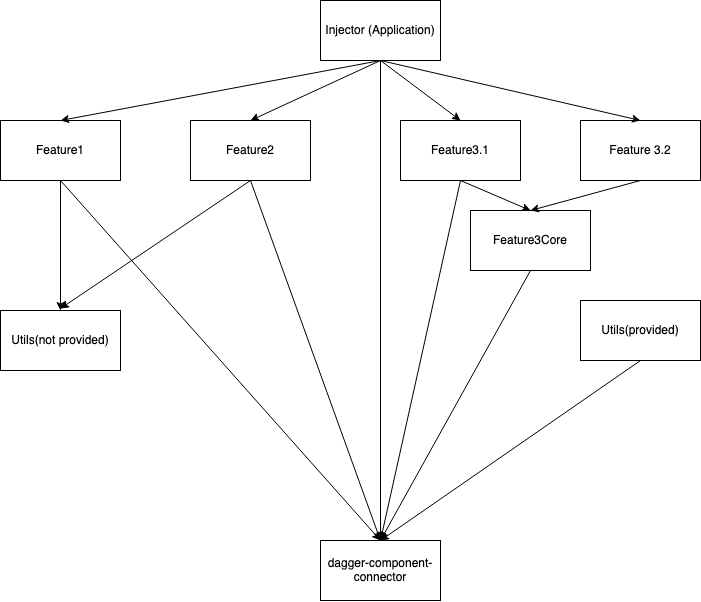

# Welcome to logoped583st tools
here you can find basic module and utilities for setuping new android app.

## Libraries and technologies:
- Kotlin
- androidX
- Ktx
- Dagger 2
- Okhttp
- RxJava
- RxAndroid
- RxBinding
- Paging 3

## Multi modularity
In 2021 year impossible to imagine a large project without splitting code base on separete modules. The main sence of using that it's increase code reusability and increase speed of gradle build.
 
Modularity explanation 

In this case as a result every feature will be independent from another and it will be like a some of reusable library.